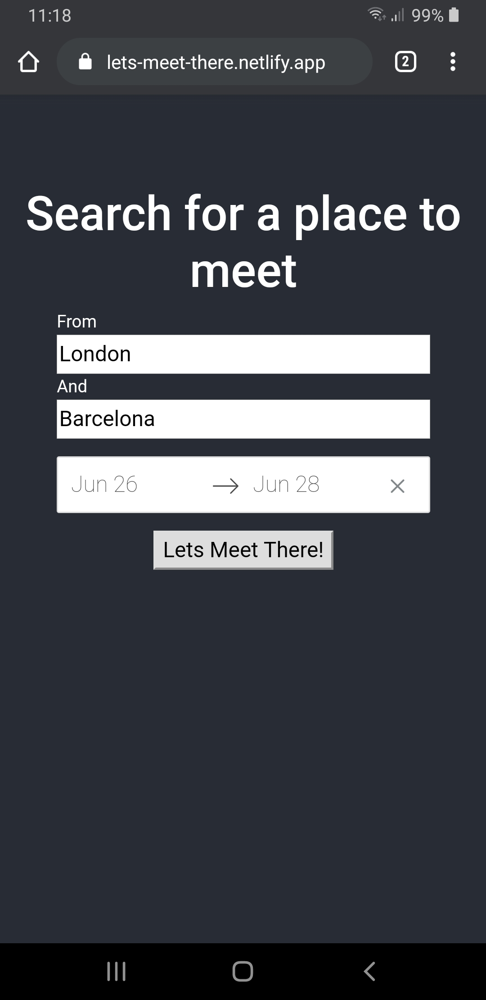
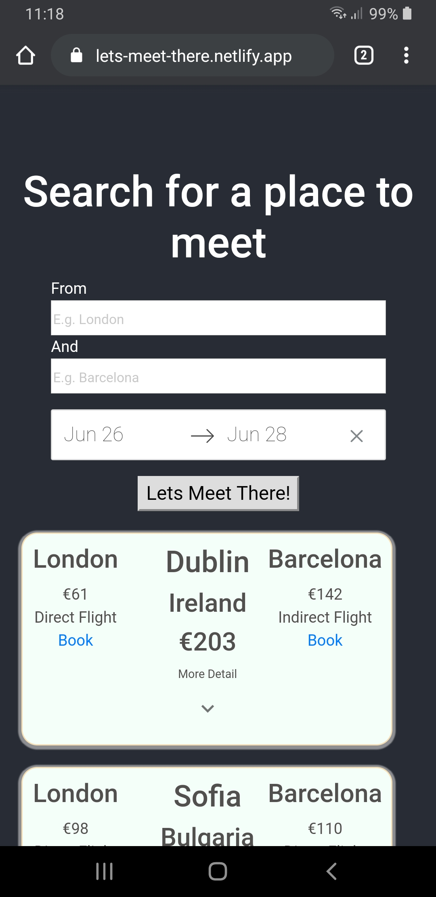

# Lets Meet There

The live site is at https://lets-meet-there.netlify.app/

Lets Meet There is a flight searching app. Starting from two locations and particular dates, it allows you to find locations where you could meet up based on the available flights.

The app is created in React with Redux and runs using the Skyscanner Api (through rapidapi.com)

  

### <u>SETUP</u>

Create a rapidapi.com account and subscribe to the skyscanner api https://rapidapi.com/skyscanner/api/skyscanner-flight-search

This will give you an API key (see screenshot below)

Now create an .env file in the client directory .

Adapt the example.env file to a .env in the same location, putting your api key in the REACT_APP_API_KEY as a string.

`REACT_APP_API_KEY = **"YOUR SKY SCANNER API KEY FROM RAPIDAPI "**`
`REACT_APP_API_URL = "https://skyscanner-skyscanner-flight-search-v1.p.rapidapi.com/apiservices/browsequotes/v1.0/US/EUR/en-US/"`
`REACT_APP_API_PLACE_URL = "https://skyscanner-skyscanner-flight-search-v1.p.rapidapi.com/apiservices/autosuggest/v1.0/UK/GBP/en-GB/?query="`

In the console, enter the commands:

`npm install`

`npm start`

which will install the dependencies and start the app. Hooray!

Go to http://localhost:3000/ to see the app.

Search for flights.

Bon Voyage!
